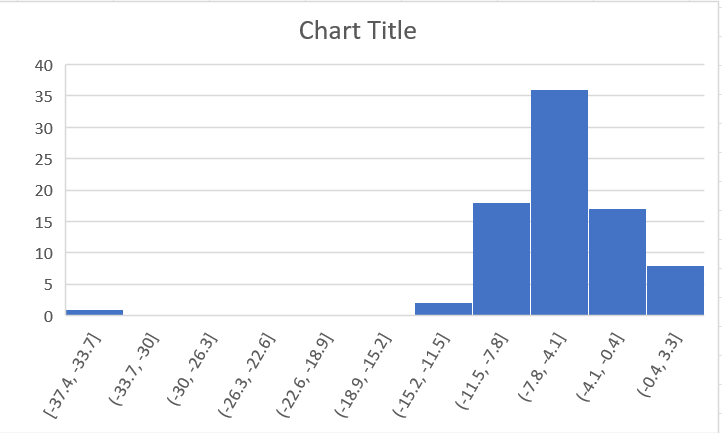

### map-reduce-krohn
Practicing mapping and reducing
## Observing Crypocurrencues using Big Data

I found a Kaggle dataset that had all of the changes for the top 100 crypto coins over a 24H, 30D, and 1Y period.
I know that there has been a lot of false hype behind a lot of crypto coin projects and I personally like a lot of other people have lost money in the crypto market.
I wondered "out of the 100 most popular crypto projects, how many of them ended the day in the negative?"

From the initial dataset, I'll map to key-value pairs: crypto, amount. 
In my case, I used the terminal "sort" command but I don't think it did anything.
A command I did find helpful was "Select-Object -Skip 1" because after mapping, my first line in my command was "crypto, amount".
Then, I'll reduce all the key-value pairs to keep only the crypto coins whose performance was less than 0 in a 24H period.

```PowerShell
cat '.\Top 100 Cryptocurrency 2022.csv' | python .\81mapper.py | Select-Object -Skip 1 | sort | python .\82reducer.py > krohn-out.txt

```

The result is out of 100 coins, 82 cryptocurrencies performed negatively.

In Excel, I created a graph to show from 0 to -40 how poorly the 82 cryptocurrencies I was left with performed.


